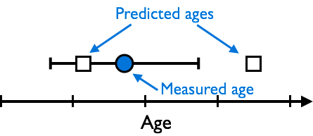

# Goodness-of-fit calculations
A ***goodness-of-fit*** calculation provides a way in which we can assess how well a set of predictions "fit" some observed or measured values (data).
Often, this kind of calculation is useful because it can provide a single number to quantify how well a set of predictions matches some data.
If we consider a very simple case, let's say we have a single mean geochronological age for a rock sample with its uncertainty (the standard deviation for the individual grain ages in the sample in this case).
We might visually represent this data as a point to display the mean and an error bar to show the standard deviation as shown below in Figure 1.

 
*Figure 1. A measured age (blue circle) with its uncertainty as an errorbar and two predicted ages (white squares)*.

In this scenario, we might reasonably consider one of the predicted ages to have a "good" fit to the data if the predicted age is within the uncertainty of the measured age.
Thus, the predicted age on the left "fits" the data, whereas the predicted age on the right does not.
The general idea is that **the predictions should be within the uncertainty in the data to be considered a "good" fit to the data**.

Keeping in mind the idea that predictions should be within data uncertainties we can now consider some of the basic *goodness-of-fit* calculations.
The first example is the ***weighted sum of the squared errors***, also often refered to simply as chi squared:

 
*Equation 1. The weighted sum of the squared errors, where Oi is the ith measured mean age, Ei is the ith predicted age, and σi is the ith standard deviation*.

This equation is quite simple in terms of the concept.
First, the difference between the mean age and the prediction is calculated and then squared.
This ensures that we are only considering the magnitude in the difference in the values, not whether the prediction is smaller or greater than the mean of the data.
Second, the calculated difference is divided by the standard deviation squared.
If the standard deviation is simply how much a value differs from the mean on average, then dividing by the standard deviation should allow us to see whether or not a prediction is within the uncertainty.
How?
Let's consider some examples.
First, if we assume that the mean value in the data and the prediction are identical, then their difference is zero, and the value of the chi-squared equation for that data point would also be zero.
If the prediction is exactly 1 standard deviation larger or smaller than the mean of the data, then the difference would be exactly the standard deviation *σ*, in which case the chi-squared value for that data point would be *σ*2/*σ*2, which equals 1.
Thus, for any prediction that falls within the data uncertainty, the chi-squared value for that prediction should be **less than or equal to 1**, with a minimum of zero.
Any value that falls outside the data uncertainty would thus have a chi-squared value of **greater than 1**.
Unfortunately, since these values for each data point are summed together, it can be a bit difficult to look at just the value of chi squared to determine how well some predictions match some data, unless the value is very close to 1.

An alternative formulation of the *weighted sum of the squared errors* attempts to make the values slightly easier to interpret by dividing by the number of values used in the calculation, as shown below.

 
*Equation 2. The normalized weighted sum of the squared errors, where N is the number of values in the summation*.

The change above is simple, we're just dividing the calculated chi-squared value by the number of values used in the summation *N*.
The advantage here is that now a value of 1.0 or less tells us that on average the predictions are within the uncertainties in the data, and a value of greater than 1.0 says that on average the predictions are not within the uncertainties of the data.

## 
**Next**: [Least squares regressions](least-squares.md) 
**Home**: [Lesson 9 main page](https://github.com/Intro-Quantitative-Geology/Lesson-9-Fitting-data) 
