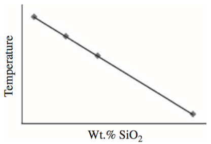

# Least squares regressions
***Least squares regressions*** are a common way of determining whether two values are *linearly* related to one an other.
In other words, this is a method to determine whether a line is a good "fit" to some measured values.
If we consider our example from [Exercise 7](https://github.com/Python-for-geo-people/Exercise-7), you calculated the line that fit seasonal average temperature data for the last ~90 years using just this approach, though we did not know its name at the time.
Not all data should be expected to be fit well by a line, but linear regressions are a powerful method for determining cases when two variables are directly related to one another.
A common example might be the temperature at which magma erupts versus the SiO2 content of the magma, as shown below in Figure 2.

 
*Figure 2. Eruption temperatures of magmas as a function of their SiO2 content with a linear regression line.
Source: Figure 16.1 from [McKillup and Dyar, 2010](http://www.cambridge.org/fi/academic/subjects/earth-and-environmental-science/earth-science-general-interest/geostatistics-explained-introductory-guide-earth-scientists?format=HB&isbn=9780521763226)*.

The general idea with calculating a *linear regression* is that we want to find the equation of a line that best fits some *x-y* data, such as temperature and SiO2 content in the example above.
To do this, we first need to recall the equation for a line:

 
*Equation 3. The equation of a line, where x and y are the coordinates of the data points, A is the y-intercept, and B is the slope of the line*.

Thus, in order to calculate a "best fit" line to some data, we will need to determine the values of the constants *A* and *B*.
Consider the example below in which *A* and *B* are known.
If we make the rather common assumption that the uncertainties for the values on the *x* axis are negligible compared to the uncertainties along the *y* axis, we can say:

 
*Equation 4. The equation of a line used to find the ith true value of y, given a known value of x*.

Thus, it is possible to find the value of *y* for two linearly related values when *A* and *B* are known.

Finding the values of *A* and *B* then for the case of a linear regression to some *x-y* data is fairly straightforward, though it does involve a bit of algebra.
For our purposes, I'll refer you to [Taylor, 1997](http://www.uscibooks.com/taylornb.htm) for a complete derivation of how to find *A* and *B*, and simply present the relevant equations below.
The value of the *y* intercept can be found using:

 
*Equation 4. The y intercept of a linear regression to data, where x is ith data point plotted on the x-axis, y is the ith data point plotted on the y-axis, and Δ is defined in Equation 6*.

The line slope can be found using:

 
*Equation 5. The slope of a linear regression of N values. Δ is defined in Equation 6*.

And the value of *Δ* is:
 
*Equation 6. The denominator for Equations 4 and 5*.

